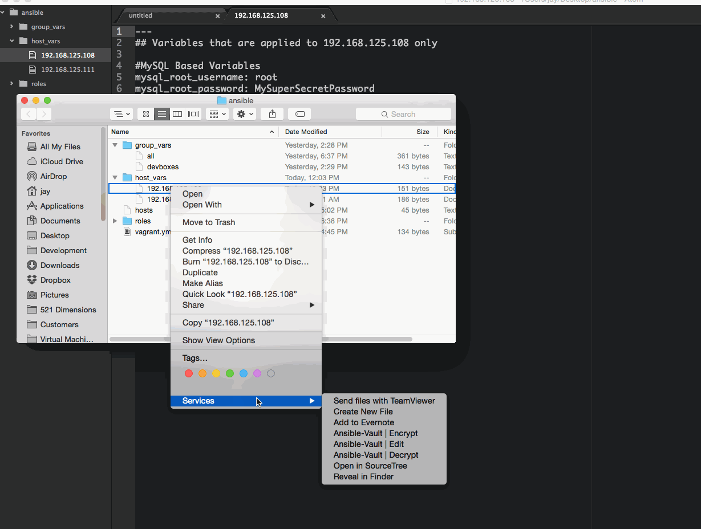
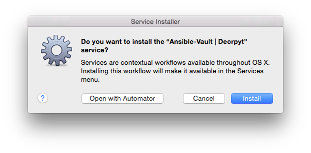

# Ansible-Vault Automator
Easily encrypt, edit, and decrypt files through Finder (rather than command line). When you choose to edit an encrypted file, you can edit it directly in Sublime Text 3 instead of `nano` or `vim`.

[](https://raw.githubusercontent.com/521dimensions/ansible-vault-automator/master/docs/assets/Ansible-Vault-Automator.gif)

## Requirements
Before you get too excited, you neeed to do the following things:

#### 1. Install the Automator Files from `services` folder
**A. Download this repo an double click on each Automator file in the services folder**

**B. Choose "Install"**


#### 2. Configure Sublime Text 3 as your default text editor (optional)
From adopting things from [Sublime 3's documentation](https://www.sublimetext.com/docs/3/osx_command_line.html), run the following commands to set Sublime Text 3 as your default text editor.

**A. Open Terminal and create link in `/usr/bin`**

```shell
sudo ln -s "/Applications/Sublime Text.app/Contents/SharedSupport/bin/subl" /usr/bin
```

You will need to enter your computer password to allow `sudo` permissions.

**B. Add variable to bash profile to set Sublime Text 3 as your default editor**

In terminal, open your bash profile by running `nano ~/.bash_profile` and add this line anywhere in that document:

```shell
export EDITOR='subl -w'
```
Press ``CTRL+O`` (that's CTRL-"OH" -- not zero) then ``CTRL+X`` to exit.

# To Do & Wish List
The following items are things that I will be working on, unless if there are higher priorities in the issues:

1. Add handlers - it would be good to add dialog boxes when it is completes or runs into an error
2. Hide and confirm password upon entry
3. Implement a way where the terminal isn't required for editing

# Legal Stuff & License

The MIT License (MIT)

Copyright (c) 2015 521 Dimensions

Permission is hereby granted, free of charge, to any person obtaining a copy
of this software and associated documentation files (the "Software"), to deal
in the Software without restriction, including without limitation the rights
to use, copy, modify, merge, publish, distribute, sublicense, and/or sell
copies of the Software, and to permit persons to whom the Software is
furnished to do so, subject to the following conditions:

The above copyright notice and this permission notice shall be included in all
copies or substantial portions of the Software.

THE SOFTWARE IS PROVIDED "AS IS", WITHOUT WARRANTY OF ANY KIND, EXPRESS OR
IMPLIED, INCLUDING BUT NOT LIMITED TO THE WARRANTIES OF MERCHANTABILITY,
FITNESS FOR A PARTICULAR PURPOSE AND NONINFRINGEMENT. IN NO EVENT SHALL THE
AUTHORS OR COPYRIGHT HOLDERS BE LIABLE FOR ANY CLAIM, DAMAGES OR OTHER
LIABILITY, WHETHER IN AN ACTION OF CONTRACT, TORT OR OTHERWISE, ARISING FROM,
OUT OF OR IN CONNECTION WITH THE SOFTWARE OR THE USE OR OTHER DEALINGS IN THE
SOFTWARE.
